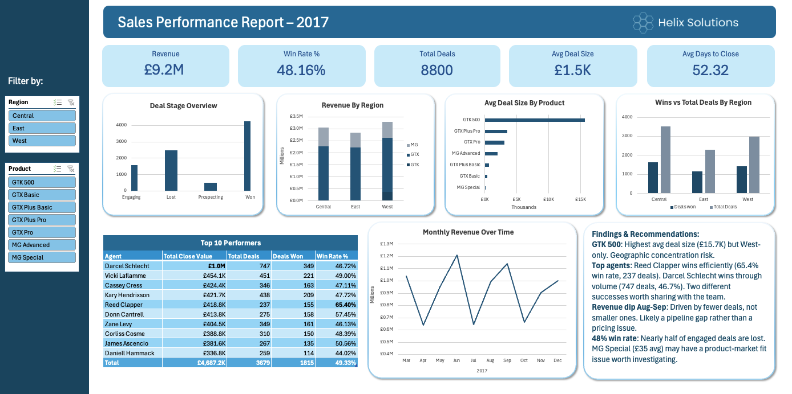

# 📊 Helix Solutions – Sales Performance Report 2017

## Contents

1. [Business Scenario](#business-scenario)
2. [Dashboard](#dashboard)
3. [Key KPIs Analysed](#key-kpis-analysed)
4. [Key Findings](#key-findings)
5. [Recommendations](#recommendations)
6. [Dataset](#dataset)
7. [Tools Used](#tools-used)
8. [Data Cleaning & Preparation](#data-cleaning--preparation)
9. [Data Modelling](#data-modelling)
10. [Project Structure](#project-structure)
 
## Business Scenario
 
Helix Solutions is a B2B software company selling across three internal sales regions: Central, East and West. With a growing product portfolio and an expanding sales team, leadership needed a clearer picture of how the pipeline was performing across the year.
 
This analysis answers the following business questions:
 
**Main question:**

- How is the sales pipeline performing, and where is revenue coming from?

**Supporting questions:**

- Which regions and products are driving the most revenue?
- How does agent performance vary across the team, and what does top performance look like?
- Where are deals being lost, and what does the win rate tell us?
- Are there any patterns in deal size or time to close that the business should be aware of?
---
 
## Dashboard
 

 
The dashboard was built entirely in Microsoft Excel using Power Query, Pivot Tables and Pivot Charts. A Region slicer and a Product slicer allow all visuals to be filtered simultaneously, making it easy to explore performance across different cuts of the business.
 
---
 
## Key KPIs Analysed
 
**Revenue & Pipeline**

- Total Revenue — £9.2M across Won deals
- Win Rate — 48.16% of all deals closed as Won
- Total Deals — 8,800 across the pipeline
- Average Deal Size — £1.5K across Won deals
- Average Days to Close — 52.32 days

**Performance Breakdown**

- Revenue by Region (Central, East, West)
- Revenue by Product Series (GTX, MG, GTK)
- Average Deal Size by Product
- Win Rate and Deal Volume by Region
- Top 10 Agent Performance by Revenue, Deal Volume and Win Rate
- Monthly Revenue Trend across 2017

---
 
## Key Findings
 
**GTK 500** — The highest average deal size in the portfolio at £15.7K, but exclusively sold in the West region. This is a geographic concentration risk — if West loses momentum on GTK 500, that revenue disappears entirely.
 
**Top agents** — Reed Clapper leads on win rate at 65.4% across 237 deals, closing fewer opportunities but with higher quality. Darcel Schlecht leads on total revenue through volume, handling 747 deals at a 46.7% win rate. Two different approaches to success worth sharing with the wider team.
 
**Revenue dip Aug–Sep** — The dip in revenue during August and September was driven by fewer deals rather than smaller deal sizes, pointing to a pipeline gap during that period rather than a pricing or product issue.
 
**48% win rate** — Nearly half of all engaged deals are being lost. MG Special, with an average deal size of just £35, may have a product-market fit issue worth investigating alongside the sales and product teams.
 
---
 
## Recommendations
 
1. **Expand GTK 500 into Central and East regions** — given its high deal value, even a modest number of deals in other regions to start off could significantly lift overall revenue.
2. **Share Reed Clapper's approach with the team** — with a win rate 17 points above average, there's a clear opportunity to understand what's working and apply it more broadly.
3. **Investigate the Aug–Sep pipeline gap** — the revenue dip appears to be a volume issue, suggesting a gap in prospecting activity earlier in the year. Worth reviewing the engagement cycle and timing.
4. **Review MG Special's positioning** — at £35 average deal size, it's unclear whether this product is generating meaningful value relative to the sales effort required to close it.

---

## Dataset
 
This project uses a sample CRM dataset representing Helix Solutions' sales activity across 2016–2017, covering 8,800 deal records across four related tables: sales pipeline, accounts, products and sales team.
 
---
 
## Tools Used
 
| Tool | Purpose |
|------|---------|
| Microsoft Excel | End-to-end analysis and dashboard |
| Power Query | Data cleaning, transformation and table merging |
| Pivot Tables | Aggregation and KPI calculation |
| Pivot Charts | Data visualisation |
| Excel Dashboard | Interactive single-page report with slicers |
 
---
 
## Data Cleaning & Preparation
 
The raw data contained a number of real-world quality issues that needed to be resolved before any analysis could take place. All cleaning was done in Power Query before building the analytical layer.
 
**Sales Pipeline**

- Inconsistent deal stage labels (e.g. "Won", "won", "WON", "Closed Won") — standardised to four clean values: Won, Lost, Engaging, Prospecting
- Mixed date formats across engage_date and close_date (YYYY-MM-DD, DD/MM/YYYY, MM-DD-YYYY) — parsed using a locale-aware custom column to handle all three formats consistently
- 15 duplicate rows — removed
- 1,425 open deals with no account assigned — replaced with "Unassigned" rather than removing, as these represent early-stage pipeline where the account has not yet been identified. Removing them would understate the true size of the pipeline
- Trailing whitespace and inconsistent casing on agent names — trimmed and proper-cased to ensure clean joins with the sales team table
- A small number of Won deals had no close_value recorded — left as null rather than replacing with zero, as zero would incorrectly imply a deal with no value

**Accounts**

- Mixed casing in sector (e.g. "Technology", "TECHNOLOGY", "tech") — lowercased and trimmed
- Inconsistent office location formatting (e.g. "US", "USA", "U.S.", "united states") — standardised to full country name
- 3 duplicate rows — removed
- Missing revenue and employee counts for some accounts — left as null, as these fields are not always publicly available and are not central to the analysis

**Sales Teams**

- Mixed casing in regional_office — standardised
- Trailing whitespace on agent names — trimmed to ensure clean joins

**Products**

- Inconsistent series casing (e.g. "GTX", "Gtx", "gtx") — standardised

---
 
## Data Modelling
 
The four cleaned tables were merged in Power Query into a single analytical table, joining on shared keys:
 
- sales_pipeline → sales_teams on sales_agent
- sales_pipeline → accounts on account
- sales_pipeline → products on product
This produced one wide analytical table used as the source for all Pivot Tables and charts, following the same principle as a star schema — keeping the analysis layer separate from the raw data.
 
**Calculated fields added:**

- days_to_close — number of days between engage_date and close_date, used to calculate average time to close for Won deals
- is_won — a binary flag (1 for Won, 0 for all other stages), used to calculate win rate across regions and agents

---
 
## Project Structure
 
```
helix-solutions-sales-report/
├── assets/
│   └── dashboard-screenshot.png
├── data/
│   └── raw/
│       ├── accounts.csv
│       ├── data_dictionary.csv
│       ├── products.csv
│       ├── sales_pipeline.csv
│       └── sales_teams.csv
├── helix-solutions-sales-report.xlsx
└── README.md
```
